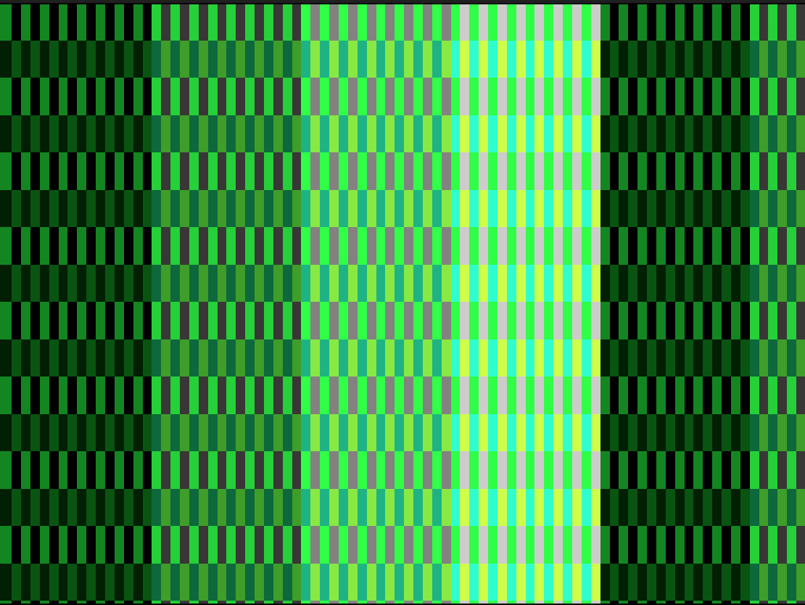

# OPEN_SPECTRE
## An open-source FPGA-based EMS SPECTRE video synth.
*A project aimed at recreating the EMS SPECTRE VIDEO SYNTHESIZER in HDL*

Open to donations and contributors with FPGA experience. 😀 

###  ✨The EMS SPECTRE Colour Video ✨
>Synthesizer is a unique and revolutionary new product: an instrument capable of producing exciting graphic images on an ordinary television screen. The complete SPECTRE package consists of the synthesizer itself, plus a Sony Trinitron colour monitor, and a Sony black-and-white TV camera. The synthesizer is compact (38"x23.5"x7"), portable (about 35 pounds), and unequalled in its simplicity and versatility.

### Design Info
#### 🎉Aim 🎉
The aim of this project is to preserve this rare and unique video synth by recreating it in an FPGA
For more info in this process take a look at: 
[Cloning Hardware Ethos](top%20level%20design/Cloning%20a%20process%20not%20a%20device.md)

#### 🍒Documentation🍒
[Auto Generated Documentation](https://cfoge.github.io/OPEN_SPECTRE-/) **CURENTLY BROKEN LINK**

#### 🥨Top Level Diagram🥨

#### 🍨List of Modules and Details Phase 1🍨(WIP)

##### TEST BUILD 1 NOTES:
Simplified elements simulated, need to build a reg file to drive the muxes, there is too much logic for a vio32.
Use microblaze or Zynq to drive a reg file that drives the 20 muxes for Luma 1, Luma2 chroma 1 and cheoma 2 (4bit select lines on the Mux)

##### Common Modules:
| Module | Notes | Built |Tested |
| ------ | ------ |-----|-----|
| inverter | n-bit wide |YES| YES|
| xor | n-bit wide |YES| YES|
| mux func | 32:1 mux |YES| YES|
| debouncer | counter based |YES| NO|
| rotary encoder | not tested on HW |YES| YES (sim)|

##### Digital Side Modules:
| Module | Notes | Circuits PDF | Built |Tested |
| ------ | ------ |-----|-----|-----|
| 800us delay | clk'd delay ||YES|YES|
| Overlay Gates |  |pg5|YES|YES|
| XY counters |9 bit counter  |pg5(xorgates & invertors)|YES|YES|
| XY invert logic |  |pg5(xorgates & invertors)|YES|YES|
| Edge Detector/Monostables | 1clk edge, make longer |pg 5|YES|YES|
| Slowcounter* | counters with rates of 6,3,1.5,8,4 & 2Hz ||NO|NO|
|Video In Comparitor|8/10bit luma only video signal to 7bit comparitor with span controll|pg 13| YES* need to check operation | NO* check test cases| 
| Inverters |4x digital inverters (1bit)|pg5| YES (common module) | YES |
| Flipflops ||pg5| YES | NO |
| Video Timing Generator || |YES|YES|
| Digital Crosspoint ||throughout |YES|YES|
| Pinmatrix ||throughout |YES|YES|

* check counter frequencies, solve slower than 1hz freqs

##### Analogue Side Modules:
| Module | Notes | Circuits PDF | Built |Tested |
| ------ | ------ |-----|-----|-----|
| random voltage gen | ||YES|YES|
| video out attenuators | ||YES|YES|
| analoge pin matrix/mixer | ||YES|sort of|

##### Other Modules:
| Module | Notes | Circuits PDF | Built |Tested |
| ------ | ------ |-----|-----|-----|
| YCCRCB to RGB | ||YES|YES|
| Audio in|*filter extern and use adc for level?||YES|YES|

##### Tools and scripts:

| Module | Notes | Design Stage | Built |Tested |
| ------ | ------ |-----|-----|-----|
| make_coe_wave.py | makes xilinx coe for rom IP |pre synth|YES|YES|
| write_file_ex.vhd | logs video signal to csv file |simulation|YES|YES|
| vga_sim.py* | reads csv from above makes image |simulation|YES|YES|
* it is way too hard to see what is happening from the signal traces alone, so this python script turns a single frame of video. [Simulated Images](https://github.com/cfoge/OPEN_SPECTRE-/tree/MVP_1/src/synth_tools/sim_images)
 

### 🍣Want to Contribute?🍣
Amazing! If you have FPGA and or Verilog/VHDL skills we would love to have you involved. But, first, there are a few things you should know. 
#### What to do first
- Look through the resources folder to get an idea of what the EMS SPECTRE is and how it works
- Look at the top-level diagram and the list of modules
#### Project Details For Contributors
- RTL in VHDL or Verilog (VHDL prefered, no system Verilog 😎 sorry) 
- One module per file with separate testbench (Verilog or VHDL test benches only)
- Test benches should print out a message at the end confirming if they are successful or not
- No HSL or auto-generated code, no busses or interfaces for now (will be busses later)
- Use any software you like, but a Vivado project will be supplied
- Follow the template for file headers and comments 📑
- Follow the folder structure for the project 📂
- All code must be opensource or MIT licence 👍

#### If after all that you still want to be involved you can do one of three things:
- Email us at *OPEN.SPECTRE.PROJECT@gmail.com* and see what modules we need to be made at the moment
- Branch the repo, make a module and submit a pull request 
- If you are not any good at git/GitHub, if you write any modules you can email them to us and we will integrate them into the project

### 🐙License🐙
Creative Commons CC BY-NC

### Donations
We are very thankful to have received donations from the following people:
Chris Korvin
Jay Hotchin
Milton Grimshaw

[//]: # (These are reference links used in the body of this note and get stripped out when the markdown processor does its job. There is no need to format nicely because it shouldn't be seen. Thanks SO - http://stackoverflow.com/questions/4823468/store-comments-in-markdown-syntax)

   [dill]: <https://github.com/joemccann/dillinger>
   [git-repo-url]: <https://github.com/joemccann/dillinger.git>
   [john gruber]: <http://daringfireball.net>
   [df1]: <http://daringfireball.net/projects/markdown/>
   [markdown-it]: <https://github.com/markdown-it/markdown-it>
   [Ace Editor]: <http://ace.ajax.org>
   [node.js]: <http://nodejs.org>
   [Twitter Bootstrap]: <http://twitter.github.com/bootstrap/>
   [jQuery]: <http://jquery.com>
   [@tjholowaychuk]: <http://twitter.com/tjholowaychuk>
   [express]: <http://expressjs.com>
   [AngularJS]: <http://angularjs.org>
   [Gulp]: <http://gulpjs.com>

   [PlDb]: <https://github.com/joemccann/dillinger/tree/master/plugins/dropbox/README.md>
   [PlGh]: <https://github.com/joemccann/dillinger/tree/master/plugins/github/README.md>
   [PlGd]: <https://github.com/joemccann/dillinger/tree/master/plugins/googledrive/README.md>
   [PlOd]: <https://github.com/joemccann/dillinger/tree/master/plugins/onedrive/README.md>
   [PlMe]: <https://github.com/joemccann/dillinger/tree/master/plugins/medium/README.md>
   [PlGa]: <https://github.com/RahulHP/dillinger/blob/master/plugins/googleanalytics/README.md>
