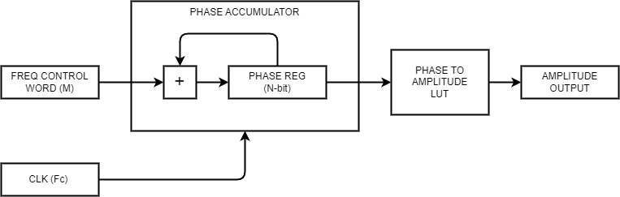

# Oscillator Spec

### Requirements
- Sine and Square wave outputs
- 0.1Hz to 50kHz
- Sync input, for line or frame sync

### Details
This is implemented using a **Numerically Controlled Oscillator**, a portion of a DDS (Direct Digital Synthesis) system. Further info can be found [here](https://www.analog.com/en/analog-dialogue/articles/all-about-direct-digital-synthesis.html#:~:text=Direct%20digital%20synthesis%20(DDS)%20is,digital%2Dto%2Danalog%20conversion.). The difference being DDS also contains elements like a reconstruction LPF and DAC which won't be needed here.

Basically a *phase accumulator* is incremented by a *frequency control word* each clock cycle, and the phase output is converted to an amplitude output through a lookup table. This allows us to recreate abitrary frequencies (with arbitrary waveforms) from a fixed reference clock.

The output frequency can be determined through the following equation:

$\large f_{out} = \frac{M * f_c}{2^n}$

- $M$ = frequency control word
- $f_c$ = clock frequency
- $n$ = width of the accumulator

The width of the accumulator along with the width of the amplitude LUT will have to be chosen based on the resources we have available and the level of frequency resolution we want to have. There need to be $2^n$ entries in the table, one for each possible phase value.

### Implementation Notes

Theoretically if we have a 40MHz clock, the accumulator needs to be at least

$ Accum Width (N) = log_2(f_{clk} / f_{max}) = log_2(40e6 / 50e3) \approx 29 $

With this width we can check whether we can hit 0.1Hz with integer accumulators and FCW

$ M = \frac{f_{out} * 2^N}{f_{clk}} = \frac{0.1 * 2^{29}}{40e6} = 1.34... $

$ int(1.34) = 1 $

$ \frac{1 * 40e6}{2^{29}} = 0.0745 Hz $

This is decent I think

As for the max value

$ M = \frac{f_{out} * 2^N}{f_{clk}} = \frac{50e3 * 2^{29}}{40e6} = 671088.64 $

$ int(671088.64) = 671088 $

$ \frac{671088 * 40e6}{2^{29}} = 49999.9523162841796875 Hz $

This means we have 671,088 discrete frequences we can represent between approximately 0.1Hz and 50KHz

Because we need a 20-bit frequency control word to represent 671088, we actually can go up to 78KHz at the max FCW value

There's lots of potential for things like power saving if we can have a transaction to update the frequency thorough the register rather than just a constant input. Also a portion of the phase_accumulator can be used as an index instead of the full value, which will save having a huge 2^29 entry table. Things like interpolation can be explored, and even storing only say 1/4 of the sine wave, and just inverting and flipping for the various phase positions.

### File Structure and Details

In terms of RTL files there are:
- oscillator.vhd
- sin_LUT.vhd

where sin_LUT imports sim_LUT_pkg.vhd which will be generated by a python script (generate_LUT.py) based on parameters from oscillator_pkg.py

Right now the oscillator is pretty generic, but still limited by importing the sin_LUT_pkg for the phase to amplitude conversion. 
I think you can add the conversion values as a generic instead which would make it more flexible, especially if deviation (currently unimplemented) is a lower fequency oscillator

